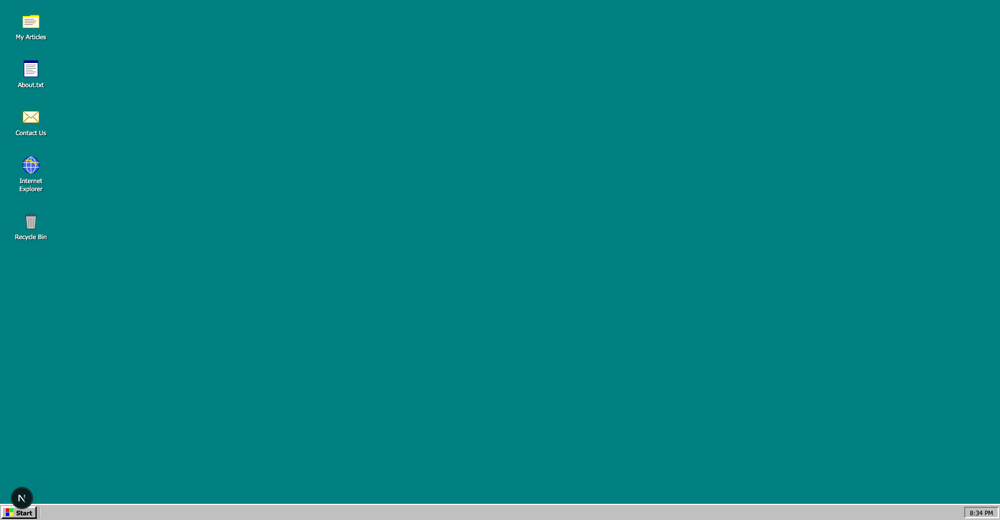
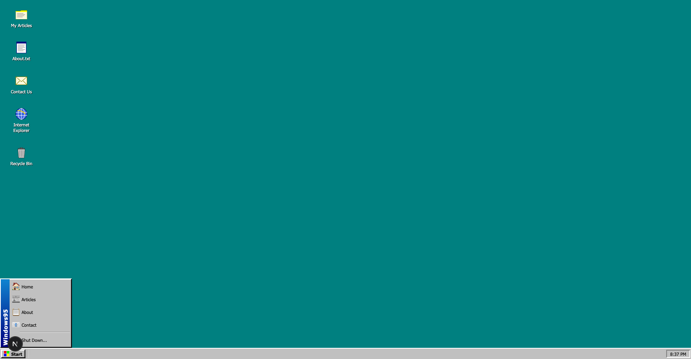
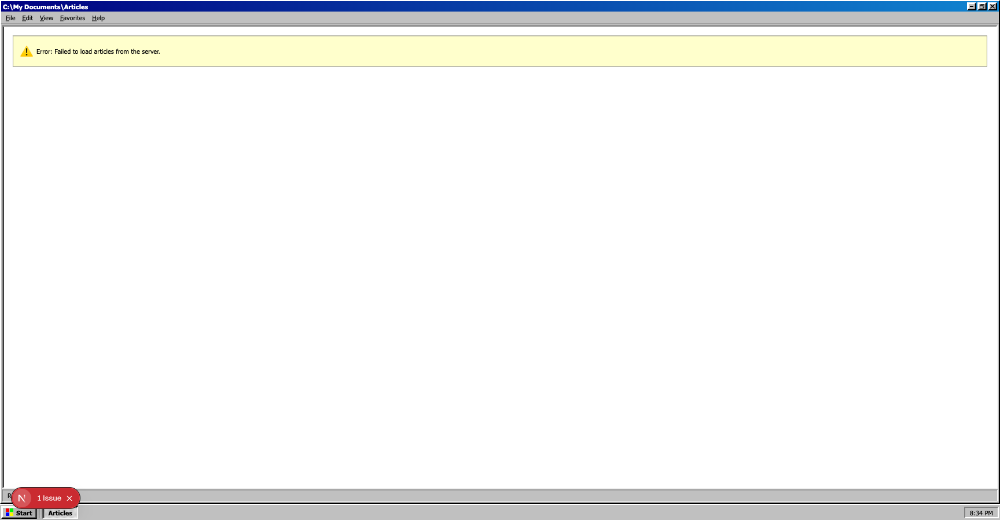
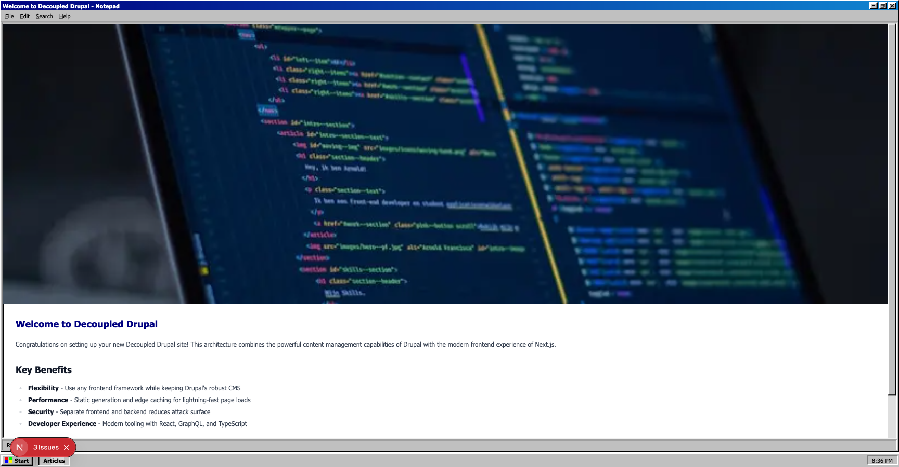
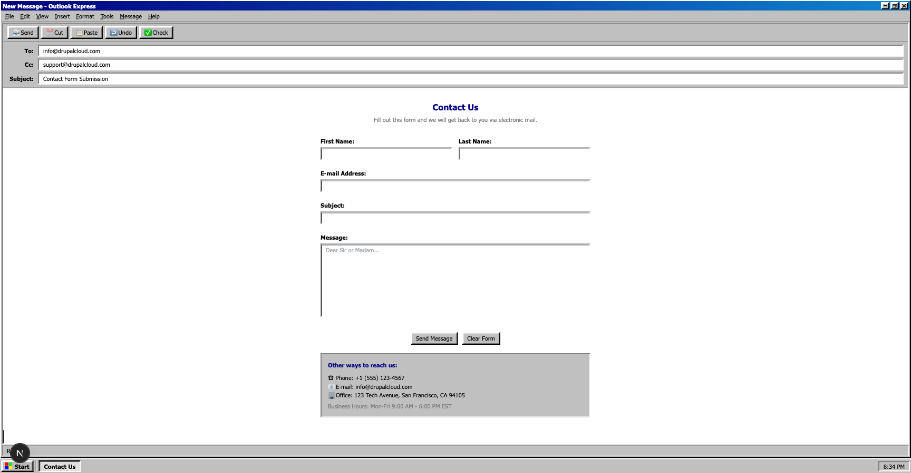

# Decoupled95

A Windows 95-themed headless Drupal frontend built with Next.js. The entire UI is styled as a retro desktop operating system, complete with draggable windows, a Start menu, taskbar, and desktop icons.



## Features

- **Windows 95 Desktop** — Homepage rendered as an OS desktop with clickable icons that open pages
- **DC95 Window System** — Every page opens in a styled window with title bar, menu bar, minimize/maximize/close buttons
- **Start Menu & Taskbar** — Fully functional taskbar with Start menu, clock, and open window indicators
- **Retro Article Browser** — Articles displayed as file listings in Windows Explorer-style windows
- **NES-style Contact Form** — Contact page styled as a Win95 dialog box
- **Trash Can Easter Egg** — Desktop trash icon opens a "deleted files" view
- **Internet Explorer Parody** — Browser page with retro DLL error dialogs
- **Headless Drupal Backend** — Powered by Drupal GraphQL via Apollo Client
- **Demo Mode** — Works without a backend using bundled mock data
- **Keyboard Navigation** — Escape key closes windows and returns to desktop

## Screenshots

| Desktop | Start Menu | Articles |
|---------|------------|----------|
|  |  |  |

| Article Detail | Contact |
|----------------|---------|
|  |  |

## Tech Stack

- **Next.js 15** with App Router and TypeScript
- **Tailwind CSS** with custom Win95 color palette and beveled border utilities
- **Apollo GraphQL** client for Drupal content
- **Drupal 11** backend via [Decoupled.io](https://www.decoupled.io)

## Quick Start

### 1. Clone and install

```bash
git clone https://github.com/jcallicott/decoupled95.git
cd decoupled95
npm install
```

### 2. Run in demo mode (no backend needed)

```bash
echo "NEXT_PUBLIC_DEMO_MODE=true" > .env.local
npm run dev
```

Visit [http://localhost:3000](http://localhost:3000)

### 3. Connect to Drupal (optional)

Run the interactive setup to create a Drupal space and import content:

```bash
npm run setup
```

Or configure manually — see [SETUP.md](SETUP.md) for details.

## Project Structure

```
app/
├── components/
│   ├── DC95Desktop.tsx      # Desktop with icons
│   ├── DC95Window.tsx       # Reusable window wrapper
│   ├── DC95Taskbar.tsx      # Taskbar with Start menu
│   ├── ArticleTeaser.tsx    # Win95-styled article cards
│   ├── DemoModeBanner.tsx   # Demo mode indicator
│   └── providers/           # Apollo GraphQL provider
├── articles/                # Articles listing page
├── browser/                 # IE parody page
├── contact/                 # Contact form page
├── trash/                   # Trash can easter egg
├── [...slug]/               # Dynamic content routing
├── page.tsx                 # Homepage (desktop)
├── layout.tsx               # Root layout
└── globals.css              # Win95 CSS utilities & colors
```

## Available Scripts

| Command | Description |
|---------|-------------|
| `npm run dev` | Start development server |
| `npm run build` | Production build |
| `npm run start` | Start production server |
| `npm run setup` | Interactive Drupal setup wizard |
| `npm run setup-content` | Import starter content |
| `npm run generate-schema` | Regenerate GraphQL schema |

## Demo Mode

Demo mode displays mock content without requiring a Drupal backend. Enable it by setting:

```
NEXT_PUBLIC_DEMO_MODE=true
```

To remove demo mode for production, delete `lib/demo-mode.ts`, `data/mock/`, and `app/components/DemoModeBanner.tsx`.

## Deployment

### Vercel

[](https://vercel.com/new/clone?repository-url=https://github.com/jcallicott/decoupled95&project-name=decoupled95)

Set `NEXT_PUBLIC_DEMO_MODE=true` in Vercel environment variables for a demo deployment.

### Other Platforms

Works with any Node.js hosting platform that supports Next.js.

## License

MIT
